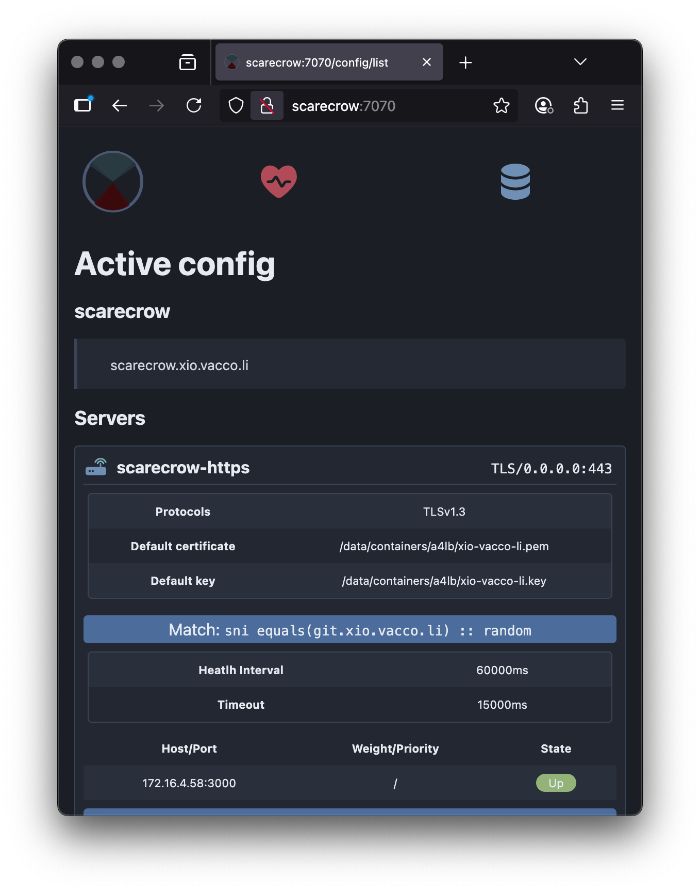

# awe4lb

`awe4lb` is a lightweight, high-performance Layer 4 (TCP/UDP) load balancer written in Java.



It supports TLS termination, backend selection via various algorithms (e.g., round-robin, weighted, IP hash, least connections), dynamic discovery (HTTP, exec, Kubernetes), health checks, and UDP proxying. Configurations use a simple JSON-based DSL for defining servers, matching rules, pools, and discovery mechanisms.

It includes a web-based UI for management and an API for runtime operations.

## Purpose

Incoming TCP/UDP traffic gets distributed across backend servers to improve scalability, reliability, and performance. Key use cases include:

- TLS-termination proxies for HTTP services.
- Load balancing for databases, APIs, or custom protocols.
- UDP forwarding (e.g., for echo servers or custom apps).
- Dynamic backend discovery in environments like Kubernetes.

It prioritizes simplicity, low overhead, and extensibility while handling production workloads.

## Features

- **Protocols**: TCP (with TLS), UDP.
- **Balancing Algorithms**: Random, weighted, round-robin, IP hash, least connections.
- **Discovery**: Static hosts, HTTP endpoints, external commands, Kubernetes API.
- **Health Checks**: Exec-based (e.g., ping, nc) with configurable intervals/timeouts.
- **Management**: REST API for config CRUD/select, web UI for visualization.

## TODO

- **Metrics**: Basic RX/TX averages, connection tracking.

## Quick Start

Grab the [latest release](https://github.com/vaccovecrana/awe4lb/releases) or [docker image](https://github.com/vaccovecrana/awe4lb/pkgs/container/awe4lb)

Run the load balancer:
```shell
a4lb --api-host=0.0.0.0 --config=./path/to/configs/directory
```

Or from a Docker image:
```shell
docker run -d --name awe4lb \
  -p 7070:7070 -p 8070:8070/udp -p 443:8443 \
  -v $(pwd)/configs:/etc/a4lb \
  ghcr.io/vaccovecrana/awe4lb:0.7.1 \
  --logLevel=info --config=/etc/a4lb
```

> Note: in both cases, the user executing `a4lb` must be able to open any ports that will be used for front-end load balancing (i.e. port `443/tcp` for TLS termination, port `22/tcp` for SSH proxying, or any other services you define).

Open `http://localhost:7070` in a browser for config management.

Using the UI, you can define load balancer configurations. In this example, we have 3 front servers. The first proxying HTTP connections, the second terminating HTTPS connections to HTTP backends, and the third proxying UDP connections via sticky sessions.

```yaml
id: test-config-00
description: Test configuration
servers:
  - id: test-http
    addr: {host: 0.0.0.0, port: 80}
    pool:
      hosts: [{addr: {host: 172.16.4.58, port: 3000}}]
    healthCheck: {intervalMs: 60000, timeoutMs: 15000}
  - id: test-https
    addr: {host: 0.0.0.0, port: 443}
    match:
      - op: {sni: {equals: test-svc0.localhost}}
        pool:
          hosts: [{addr: {host: 172.16.4.59, port: 3000}}]
      - op: {sni: {equals: test-svc1.localhost}}
        pool:
          hosts: [{addr: {host: 172.16.4.58, port: 3000}}]
        healthCheck:
          exec: {command: nc, args: ['-z', '-v', $host, $port]}
    tls:
      ciphers: [TLS_AES_128_GCM_SHA256]
      base:
        certPath: ./src/test/resources/certs/awe4lb.pem
        keyPath: ./src/test/resources/certs/awe4lb.key
  - id: test-udp-echo
    addr: {host: 0.0.0.0, port: 8070}
    match:
      - pool:
          type: ipHash
          hosts: [{addr: {host: 127.0.0.1, port: 6000}}]
        healthCheck:
          exec: {command: ping, args: ['-c', '1', $host]}
    udp:
      bufferSize: 2048
      idleTimeoutMs: 2000
      maxSessions: 1024
```

For an in-depth example load balancing configuration, see [test-config-00](./a4-test/src/test/resources/test-config-00.json)

## Configuration notes

- TCP buffer sizes are currently determined by the Operating System.
- UDP buffer sizes are application specific. Default is 16384 bytes.

## Security considerations

- Do not allow public access to the REST api, since it allows for full management. Expose it only within a trusted network perimeter.
- Most applications and use cases should work fine with the default TCP buffer size. However, applications which stream large amounts of data should make sure that the underlying hardware has enough memory capacity to handle backpressure from either clients or backends.

## Development

Requires Gradle 8 or later.

Create a file with the following content at `~/.gsOrgConfig.json`:

```
{
  "orgId": "vacco-oss",
  "orgConfigUrl": "https://raw.githubusercontent.com/vaccovecrana/org-config/refs/heads/main/vacco-oss-java-21.json"
}
```

Then run:

```
gradle clean build
```

## Similar projects

- https://www.envoyproxy.io/
- https://gost.run/
- https://github.com/yyyar/gobetween

## Resources

- https://docs.oracle.com/en/java/javase/11/docs/specs/security/standard-names.html#jsse-cipher-suite-names
- https://stackoverflow.com/questions/53323855/sslserversocket-and-certificate-setup
- https://stackoverflow.com/a/62263402/491160
- https://github.com/raell2/SSLAsynchronousSocketChannel/tree/master
- https://stackoverflow.com/questions/14225957/socket-vs-socketchannel
- https://bugs.openjdk.org/browse/JDK-8202625
- https://github.com/yyyar/gobetween/issues/335
- https://github.com/felipejfc/go-udp-echo-server

In memory of James Perry McCaffrey (March 27, 1958 – December 17, 2023).

## A Message from Dr. Casper Darling

Hello there! I'm Dr. Casper Darling, head of research at the Federal Bureau of Control.

Now, listen closely, because what we have here with `awe4lb` is nothing short of remarkable.
It's a load balancer, yes, but think of it as a Control Point in the digital realm—routing TCP and UDP traffic through sockets that act like our very own Thresholds!

These altered streams of data, infused with the energies of everyday networks, are balanced across backends with algorithms as precise as binding an Object of Power.
We've got discovery methods pulling from HTTP, commands, even Kubernetes—containing the chaos, keeping it stable.

But remember, every connection could be an intrusion, a potential AWE waiting to unfold.
As for me, well... I've been exposed to something profound, a resonance that's changing everything. This is my final presentation on the matter.

Use `awe4lb` wisely; the Bureau's depending on it. Darling, out.